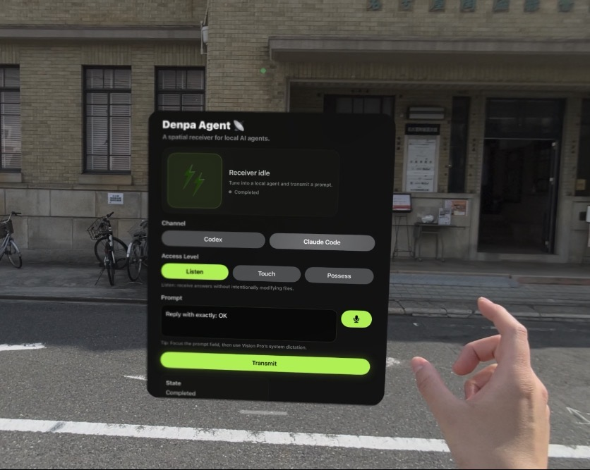

# Denpa Agent 📡



**A spatial receiver for local AI agents.**

Denpa Agent は、Apple Vision Pro から Mac 上で動くローカルAIコーディングエージェントを操作するための実験的な visionOS アプリです。

Codex / Claude Code を切り替え、Access Level を選び、空間UIから Prompt を送って Transmission として結果を受け取ります。

> Experimental prototype. App Store向けの正式製品ではありません。

## Core UI

- **Target Repo**: `agent/repos.json` に登録したrepoを選択する
- **Channel**: Codex / Claude Code を単独または両方選択する
- **Access Level**: AIにどこまで権限を渡すか選ぶ
- **Prompt**: 指示する
- **Transmission**: 結果を受け取る

## Access Levels

- **Listen**: 説明や回答を受け取るモード
- **Touch**: ファイル編集を許可するモード
- **Possess**: ファイル編集やコマンド実行など、より強い操作を許可するモード

> Possess mode can be dangerous. Use only in trusted local repositories.

## Dual Transmission

Codex と Claude Code の両方を選択すると、Dual Transmission mode になります。

Dual Transmission は、同じPromptを両方のエージェントに送り、以下の2つのSignalとして結果を受信します。

- **Codex Signal**
- **Claude Code Signal**

安全のため、Dual Transmission は **Listen / Proposal Only** として動作します。

このモードでは、ファイル編集やコマンド実行を目的とせず、2つのエージェントから提案を受け取り、比較するために使います。

良いSignalを選んだあと、必要に応じて単独Channelで再Transmissionしてください。

## Architecture

Apple Vision Pro  
→ Tailscale / local network  
→ Mac  
→ Denpa Agent Server  
→ Codex / Claude Code

## Network

Denpa Agent は、Mac上で動く local server に接続して動作します。

Apple Vision Pro と Mac が同じローカルネットワーク上にある場合は、MacのローカルIPを使えます。

外出先から自宅Macに接続する場合は、MacとApple Vision Proの両方に Tailscale を入れ、MacのTailscale IPを `baseURL` に設定してください。

Example:

```swift
private let baseURL = "http://YOUR_TAILSCALE_IP:8787"
```

## Requirements

### Mac

- Node.js
- npm
- Codex CLI または Claude Code CLI
- 外部ネットワークから接続する場合は Tailscale

### Apple Vision Pro

- visionOS
- Xcode

## Setup

### 1. Start the local agent server

```bash
cd agent
npm install
cp repos.example.json repos.json
```

Edit `repos.json` for your local projects:

```json
{
  "sampling": "/Users/yourname/Desktop/sampling",
  "view": "/Users/yourname/Desktop/View"
}
```

Each key becomes selectable in **Target Repo** inside Denpa Agent.

Then start the server:

```bash
node server.js
```

### 2. Configure the visionOS app

`visionOS/` にある Xcode project を開きます。

`ContentView.swift` の以下を自分の環境に合わせて変更してください。

```swift
private let baseURL = "http://YOUR_TAILSCALE_IP:8787"
```

同じローカルネットワークで使う場合は、MacのローカルIPでもOKです。

```swift
private let baseURL = "http://YOUR_LOCAL_IP:8787"
```

### 3. Build and run

XcodeでApple Vision Proを選択してBuild / Runします。

## Current Status

- visionOS native UI
- Target Repo picker from `agent/repos.json`
- Codex / Claude Code channel switching
- Multi-channel selection for Codex / Claude Code
- Dual Transmission mode for receiving Codex Signal and Claude Code Signal
- Dual Transmission runs in proposal-only Listen mode
- Listen / Touch / Possess access levels
- Local Mac agent server
- Lightning receiver animation while receiving
- Experimental GitHub prototype

## Notes

このプロジェクトは、ローカル環境・個人利用・実験用途を想定しています。

Do not expose the local server to the public internet.